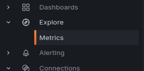
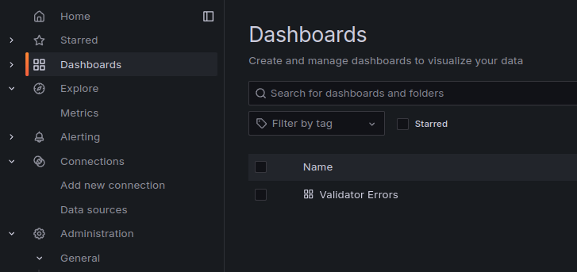

# Observability

As a part of the Validator deployment, A full observability stack is provided. Make sure to set the following vars (unless you've ran the config generator at which point this will be done for you):

```bash
GRAFANA_USERNAME=admin
GRAFANA_PASSWORD=hunter2
```

After starting the Validator, head to `http://<server_ip>:3000`
and log in with `GRAFANA_USERNAME` and `GRAFANA_PASSWORD`. You can find all of
the Prometheus Metrics in the Metrics tab:



Go to the `Dashboards` tab to explore some pre-built dashboards. The `Validator Errors` dashboard is useful to quickly diagnose issues.


