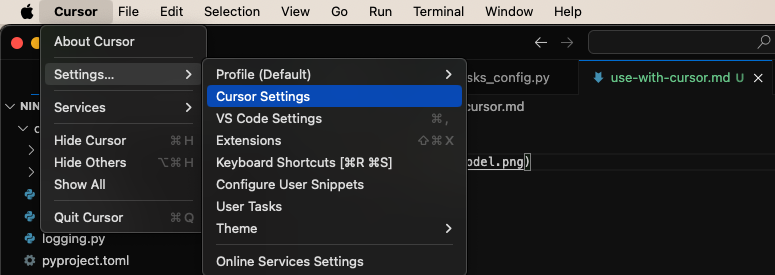
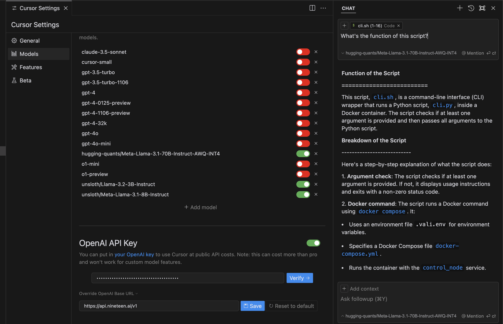

# Guide to use SN19 with Cursor

### **Open settings**
Follow these steps on a mac:

If you're on ubuntu or windows, please visit https://www.apple.com/shop/buy-mac for further instructions

### **Add a new model, named exactly `unsloth/Llama-3.2-3B-Instruct`**

It's very important the name matches exactly

### **Configure custom 'OPENAI' endpoint**

First, disable all other OpenAI models. Don't worry, they're degraded to hell anyway

Use:

Override OpenAI Base URL: `https://api.nineteen.ai/v1` 

Key: Visit https://nineteen.ai/app/api and sign up for an API key, add the same to `OpenAI API Key` field

# Done
Enjoy :)